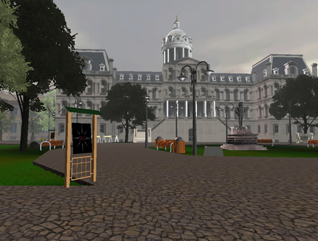

# (PART\*) Introduction {-}

# Virtual Silcton Introduction

Welcome to the documentation for **Virtual Silcton**.

The Virtual Silcton environment was originally designed in [Unity3D](https://unity.com/) by [Victor Schinazi](vschinaz@bond.edu.au) and Drew Dara-Abrams. In 2011, Steven Weisberg began updating and maintaining the documentation and website for administration of the Virtual Silcton environment.

This documentation was drafted by [Steven M. Weisberg](scannlab.psych.ufl.edu) and last edited on the date at the top of this page.

## Important Links
