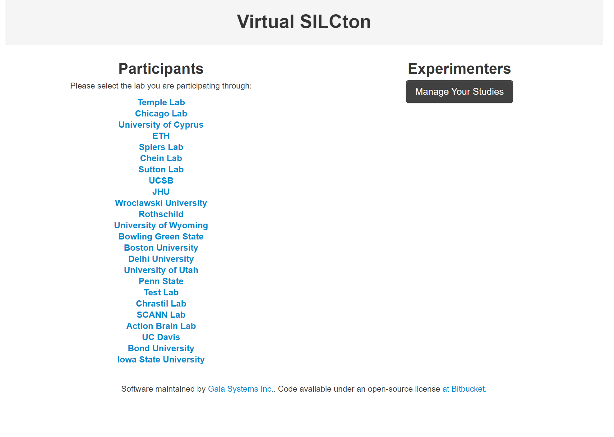

# (PART) Virtual Silcton Website {-}

# Experimenter Interface

If you are interested in collecting your own data using the Virtual Silcton *website*, start here. 

To begin, you need to set up an account. Email Steven Weisberg [stevenweisberg at ufl dot edu](mailto:stevenweisberg@ufl.edu) using an institutional email and provide a current CV. You will receive instructions for how to login. 

## A note about IRB Approval
Temple University maintains an omnibus IRB protocol, which covers administrative access to the Virtual Silcton website. Steven Weisberg, Nora Newcombe, and web developers in our employment will have access to data collected from all *Labs*. 

*YOU MUST OBTAIN YOUR OWN INSTITUTE'S IRB APPROVAL*. To run your own study, you are required to provide informed consent at follow all protocols under a separate IRB from your home institution. Steven Weisberg and Nora Newcombe do not manage or maintain this information. [See also Section 7.1](#consent)

## Setting up an Account

The link you receive will send you to the Silcton Splash page: 

The links on the left will route participants to the studies that are visible on the website. 

The link on the right, "Manage Studies", will take you to the experimenter interface. The administrator has created a *Lab* for you, which you can log into. 

The Virtual Silcton Website is broken up into *Labs*, which are only accessible to Administrators (Steven Weisberg, Nora Newcombe, web developers) and Lab-specific personnel. In your lab, only the people whose accounts you set up will have access to your studies and data. 

## Labs
Labs are the main partition of the Virtual Silcton Website. Each *Lab* has the capability of creating studies, administering studies, and managing their own data. No other labs have access to your data. 

## Studies
A Study is a data collection partition within a lab. All participants collected via one Study will be affiliated together throughout the Experimenter Interface. Studies can be customized in various ways (See [Building Studies][Building Studies].)

Clicking on the *Studies* tab of the Experimenter Interface displays all Studies your lab has created, along with some meta-data about the Study. 

## Account Types

### Experimenters
For the lab they belong to:
1. Can view materials, participants, and data from the Experimenter Interface. 
2. Can edit Studies and delete Participants for Studies which they have been assigned Primary Experimenter.

For all labs:
3. View publicly-available data. (See [Studies][Building Studies]).

### Lab Managers
Have all the capabilities of Experimenters, PLUS:
For the lab they belong to: 
1. Can delete participants.
2. Can view all lab data. 
3. Can add, edit, and delete Lab Managers, Experimenters, and Studies.

### Administrators
Have all the capabilities of Lab Managers, PLUS:
For all labs: 
1. Can delete participants.
2. Can add, edit, and delete Studies.
3. Can add, edit, and delete Administrators. 

