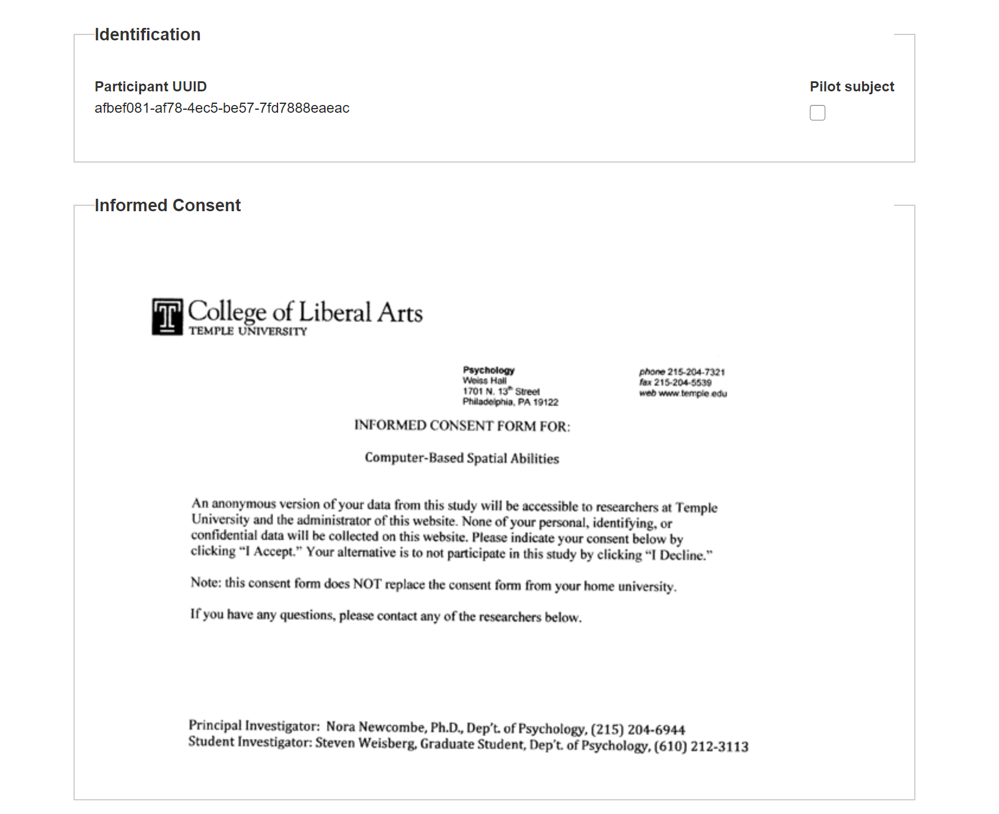

# Other Measure Descriptions

## Introduction Page

At the beginning of each Study, two measures are automatically included: Informed Consent and Web Data Release. 

At the top of the Intro Page, the Welcome Text appears, along with the name of the Study. Below that is the Participant's UUID and an option to select "Pilot subject." 

The pilot subject checkbox is for experimenter internal use. If you wish to indicate that a Participant is just a Pilot Subject, indicate that by checking "Pilot subject." The only thing this changes is how the Participant's data is labeled on the "View Participants" page. 

### Informed Consent {#consent}
The consent form and web data release are automatically included in all studies. 

Again, be advised, IRB approval and consent procedures MUST BE SEPARATELY ADMINISTERED at the home institution of the Silcton user. 

In order to store data on our servers, the Participant MUST consent to allow anonymized data to be stored on the website. The version of the consent form that participants agree to on the website allows administrators to view the anonymized data. If the Participant does not consent, they can not be enrolled in the Study. 

We require the following language to be included in any IRB protocol and informed consent involving Virtual Silcton: 

> An anonymous version of the data collected on the website from this study will be accessible to the
> administrators of that website (Virtual Silcton). None of your personal, identifying, or confidential
> data will be collected on this website.

The Participant provides informed consent by clicking "I Agree" at the bottom of the Intro Study page. 

### Web Data Release

The second automatic item (included in all studies) is the web data release form. This form allows the Participant to grant permission to share their anonymized data with any researchers who wish to access it and who are granted that ability by the adminstrators. 

The web data release can be declined and the Participant can still take part in the Study. To agree to the web data release, the Participant selects 'Yes' in the yellow box and enters their initials. (Initials are NOT stored on the website). To decline, the Participant selects 'No.'

## Demographics

Basic demographic information. 

## Santa Barbara Sense of Direction Scale

The SBSOD is a self-report measure of navigation ability. For more information, see [here](https://www.silc.northwestern.edu/santa-barbara-sense-of-direction-sbsod/).

## Philadelphia Verbal Ability Scale

The PVAS is a self-report measure of verbal ability. More info [here.]( https://link.springer.com/chapter/10.1007/978-3-642-14749-4_10)

## Philadelphia Spatial Ability Scale

The PSAS is a self-report measure of small-scale ability. More info [here.]( https://link.springer.com/chapter/10.1007/978-3-642-14749-4_10)

## Mental Rotation Test

The MRT is an objective measure of small-scale spatial ability requiring participants to match a target figure to two rotated versions of the figure (and correctly reject two non-identical figures). As administered here, the MRT consists of sample problems, practice problems (which the participant must get correct), and two sets of 10 test items. Each set of test items is timed, the Participant has 3 minutes per set. Once time expires, that set will end. More info [here.](https://www.silc.northwestern.edu/library-of-shepard-and-metzler-type-mental-rotation-stimuli/)
