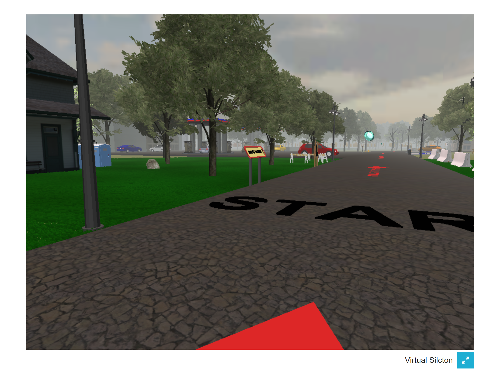
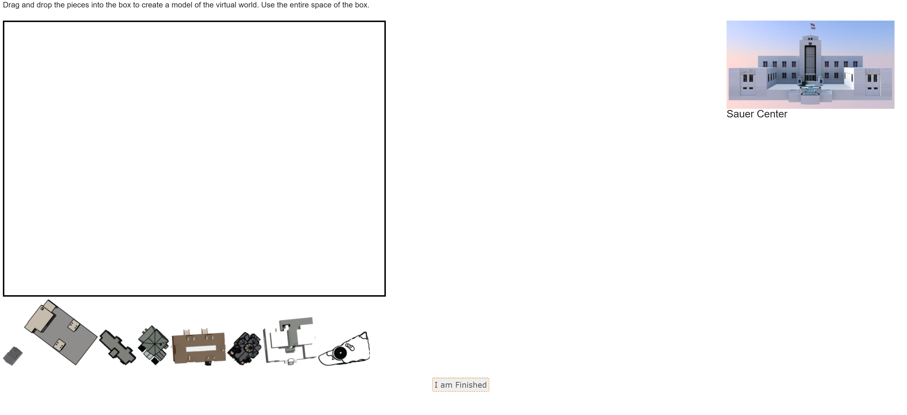
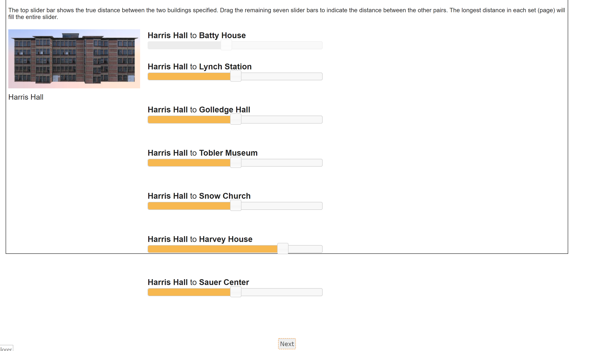

# Silcton Measures

Virtual Silcton measures are those relating to the encoding and retrieval of the Silcton environment. 

A note about online administration: load times may be long for the virtual environments. A relatively new computer, a stable internet connection, a recent version of Chrome or Firefox, and a traditional mouse (rather than a touchpad) are all recommended. 

It is also recommended for all Virtual Silcton measures (except Distance and Offsite Pointing) that the Participant clicks the Blue arrows in the lower right of the screen to make it Full Screen.

The Encoding measures can be exited by pressing Escape on the keyboard, then clicking the "I am Finished" button that appears on the browser in the lower left. 

The Onsite Pointing measure must be completed by clicking through all trials (56 in total). 

**A note on landmark names:**
The landmarks names for Virtual Silcton were chosen to be distinctive and consistent with the building they name (e.g., a Museum-like building). 

The names were also chosen in deference to notable geographers. In addition to being less than representative (all names belong to white men), in one case, this resulted in a gas station being named after a famous geographer, Kevin Lynch. We have adapted all materials to participants to clarify that all buildings were named in such a manner, and recommend that all experimenters notify their participants as well. 

- [Michael Batty](https://en.wikipedia.org/wiki/Michael_Batty)
- [Kevin Lynch](https://en.wikipedia.org/wiki/Kevin_A._Lynch)
- [Chauncy Harris](https://en.wikipedia.org/wiki/Chauncy_Harris)
- [David Harvey](https://en.wikipedia.org/wiki/David_Harvey)

- [Reginald Golledge](https://en.wikipedia.org/wiki/Reginald_Golledge)
- [John Snow](https://en.wikipedia.org/wiki/John_Snow)
- [Carl Sauer](https://en.wikipedia.org/wiki/Carl_O._Sauer)
- [Waldo Tobler](https://en.wikipedia.org/wiki/Waldo_R._Tobler)

## Encoding

All methods of encoding also record the Participant's facing direction and location every 100ms. These data can be found under the Navigation Log section of View Data. 

### Routes

Routes are prescribed paths through Virtual Silcton consisting of marked roads (using red arrows). Participants are bound along these routes by invisible walls that will prevent them from exploring beyond the routes. 

#### Main Routes

The Main Routes (A and B) each consist of 4 named landmarks that the participant is responsible for learning. The landmarks are indicated along the route with a blue gem, and named with a yellow and red sign. It is suggested that the Participant navigate from the beginning of each main route to the end and back. 

#### Connecting Routes

The Connecting Routes (C1 and C2) are additional chances to explore the environment. Each Connecting Route connects one Main Route to the other. It is suggested that the participant navigate from the beginning of each Connecting Route to the end and back. 

#### Fixed vs. Random Route Presentation

In the Edit Study view, Main Routes and Connecting Routes can be added in a RANDOMIZED order or in a FIXED order. 

For the standard Virtual Silcton learning paradigm, it is recommended to begin with both Main Routes (order randomized across Participants), followed by both Connecting Routes (order randomized across Participants).

To accomplish this, add the "Virtual Silcton Route Learning (Main Routes)" TWICE. Followed by the "Virtual Silcton Route Learning (Connecting Routes)" TWICE. This will randomize the order of the Main Routes and Connecting Routes across Participants. 

However, you can also add as many presentations of each of the four routes in any order you wish. To do this, simply add the Instrument with the Route name: "Virtual Silcton Route Learning (Main Route A)". This will always present that route in that order. In other words, an Instrument ordering like this: 

Virtual Silcton Route Learning (Main Route A)
Virtual Silcton Route Learning (Main Route B)
Virtual Silcton Route Learning (Main Route A)
Virtual Silcton Route Learning (Main Route C1)

Will present: A, B, A, C1. 

Whereas this: 
Virtual Silcton Route Learning (Main Routes)
Virtual Silcton Route Learning (Main Routes)
Virtual Silcton Route Learning (Connecting Routes)
Virtual Silcton Route Learning (Connecting Routes)

Will present: A/B, B/A, C1/C2, C2/C1. 

### Free Exploration Mode

In contrast to Routes, encoding can take place by the Participant wandering (or following directions provided by the experimenter) around the Virtual Silcton environment freely. Landmarks are still named, but there are no red arrows, nor are there invisible boundaries. 

At this time, only one starting location is provided. 

## Retrieval 

There are four retrieval tasks available at this time. Data can be downloaded for each separately through the View Data screen in the Experimenter Interface. 

### Onsite Pointing Task

The Onsite Pointing Task places the Participant next to each of the eight main landmarks, in the same fixed order (starting from the first building on Route A, through the last building on Route B). The Participant must point a crosshair in the center of the screen to the front door of the named building and click the mouse to indicate their response. Once they click, the prompt at the top of the screen will change. After the Participant has pointed to each landmark from the landmark they are standing next to (besides *that* landmark), they will be placed next to the next landmark, where they will point to all the other landmarks again. 

### Model Building Task

The model building task requires the Participant to drag and drop an aerial view image of each landmark to the position in the black outlined box that the Participant believes the landmark to be located. 

Hovering over the aerial view image of each building displays a picture of the front view of the building along with its name. 

Landmark models should be positioned FULLY INSIDE the black rectangle, or their positions may not be recorded. 

Note: It is not possible to rotate the landmark models. This information can either be used by the Participant to aid them or can be ignored.  

### Offsite Pointing Task 

The logic of the offsite pointing task is the same as the Onsite Pointing Task. The Participant "begins" at each landmark, and indicates the directions to all other landmarks as if they are facing the next landmark. For example, in the image below, the Participant should imagine standing along the route next to Batty House, facing toward the gem (or diamond) indicating Lynch Station. The Participant must then drag and drop each of the grey rectangle to the position on the black circle that indicates the direction a compass needle would point if it pointed directly at the front door of that building. For example, if the Participant thought that the front door of Batty House was directly to her left, she should place the grey rectangle containing Batty House on the "West" position of the circle (or 9 o'clock). 

Once all grey rectangles have positioned while at that "location," the Participant clicks "Next" and the next location is loaded as a new circle. 

Similar to the Model Building Task, hovering over the names of the buildings or diamonds provides a front view of the building. 

### Distance Estimation Task

The Distance Estimation Task requires the Participant to indicate the relative distances to and from each pair of landmarks. The Participant can view the distance from one landmark to another (in the figure below, the distance between Harris Hall and Batty House is set). The longest distance will always be the full length of the slider. The Participant must then set each other distance. Once all judgments have been made from one landmark (e.g., Harris Hall, below), clicking Next will load the next set of distance judgments with a new reference distance. 

To my knowledge, data on this task has not been published, nor has it been validated with other measures. In my (SMW) experience, participants find it somewhat confusing. For that reason, we do not recommend it. 

