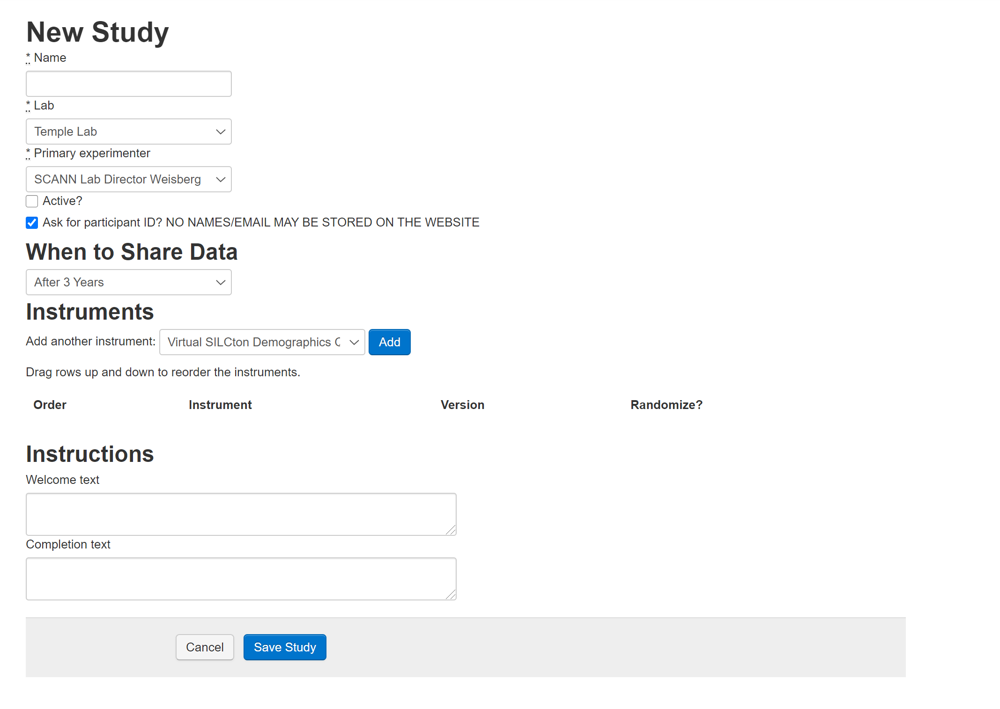

# Building Studies

## Create Study

In the Study tab of the Experimenter Interface, you can view all Studies you created along with their meta-data. Scrolling to the bottom of this list, you'll find a "Create Study" button. Clicking this will create a new Study. 

## Edit Study

When you first create a study (or, if you click "Edit Study" for a study you've already created), you will be able to customize it with the following options: 

1. Name: How your study will be referenced throughout the Silcton website. 
2. Lab: The lab the study is affiliated with. (Note, if you choose a lab you are not affiliated with, you will not have access to the data collected from it.)
3. Primary Experimenter: The experimenter in charge of editing the study. (Note, Lab Managers will still be able to edit participants and studies for their lab. If an Experimenter is assigned this role, they will have these capabilities only for this Study).
4. Active: If checked, the Study will be viewable by any visitor to the main web page. **ONLY CHECK THIS FOR STUDIES YOU HAVE IRB APPROVAL TO RECRUIT AND COLLECT DATA FOR ANYONE WHO FINDS THE WEBSITE**
5. Ask for participant ID? (DEPRECATED - no custom IDs are possible.)
6. When to Share Data: All data collected via the Virtual Silcton repository will be made public after a 3-year embargo period for Participants who agree to the Web Data Release. The experimenter has the option to make data public immediately rather than waiting 3-years. Public data are made available to all Virtual Silcton website users. 
7. Instruments: The dropdown menu provides all instruments available through Virtual Silcton. See [Silcton Measures](Silcton Measures) and [Other Measures](Other Measures). Instruments can be added in any combination (including repetitions) to Studies. To add an Instrument, navigate to the Edit Study view for the study you wish to edit, select the Instrument from the dropdown menu, and click "Add." Once added to the list, Instruments can be dragged-and-dropped to any order you wish.
8. Welcome Text: Text entered here will appear on the first page the participant sees. (HTML Tags can be used in this field.)
9. Completion Text: Text entered here will appear after the final instrument is completed. (HTML Tags can be used in this field.)

Once the study has been created, click Save Study. 

After you save the Study, you'll see 4 tabs. 

View Study will show you the Study details. 

Edit Study will allow you to edit the Study as you did when you created it. 

View Participants will show you the Participants you collected thus far, their IDs, whether they've elected to share data, if they were designated a Pilot subject, and the date of data collection. You also have the option to Delete them, but **this action is not undoable** so use caution. 

### Participant IDs

Participants automatically receive two forms of ID in the Virtual Silcton study. A Participant UUID is a unique identifier assigned to every participant (whether supervised by an experimenter or not) who navigates to the Study Intro page (see [Other Measures](Other Measures)) and clicks Begin Experiment. 

The UUID is random and unique, but not very user friendly. 

A Participant Identification number will also be assigned once the experiment has begun. This number will increment by 1 for all data that was COLLECTED for that study. 

In other words, if you collect Participant #100, delete that participant, and run another participant, the second participant's number will be #101. 

## View Data

The data for Virtual Silcton is split up across the various measures. The View Data tab allows you to view and download the data for each study. Unfortunately, this can only be done per measure at the moment. 

Clicking [Copy], [Excel], [CSV] will save the data in those formats. For more information, see [Silcton Measures](Silcton Measures) and [Other Measures](Other Measures). 

## Interface Bugs
A quick note about the interface: It's a little clunky to move from the Study view to the Data view. In particular, the "View Study" button becomes highlighted during "Edit Study." The easiest way to navigate from Data to Study views is to click back on Studies on the top black bar. 

